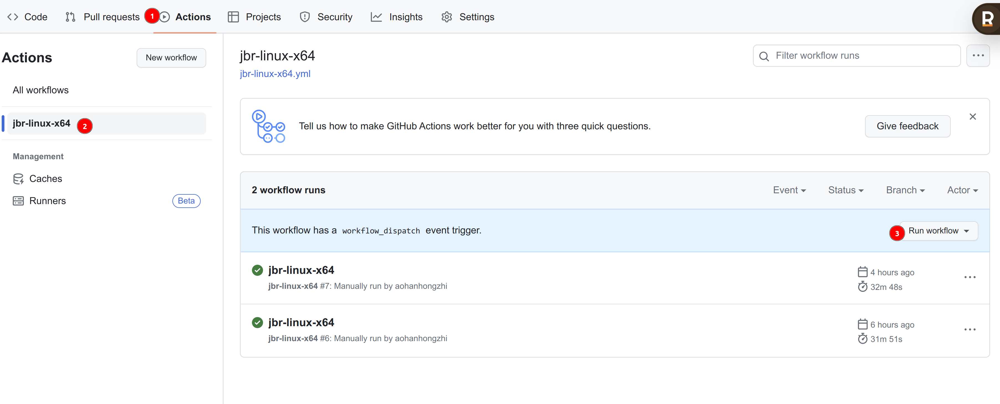

# 构建自己的JBR

利用github action的构建自己的JBR

## 获取releaseId 

访问下面接口，获取releaseId 

https://api.github.com/repos/JetBrains/JetBrainsRuntime/releases

> 如果有 `{"message":"API rate limit exceeded for 54.254.181.25. (But here's the good news: Authenticated requests get a higher rate limit. Check out the documentation for more details.)","documentation_url":"https://docs.github.com/rest/overview/resources-in-the-rest-api#rate-limiting"}`，那就等等

从上图可以看到 releaseId是 115436451

## 选择合适分支

从官方的JBR中选择合适的分支,目前选择17

https://github.com/JetBrains/JetBrainsRuntime

## 运行Github Action

## 特别事项

构建版本主要注意，构建环境，如果是ubuntu使用版本号要对应。

如果是deepin 20.9 那么需要 ubuntu18.04的构建环境。

# fock说明
原地址大佬目前没有继续更新，而github基于ubuntu18.04的workflow一直处于等待，无法生成新包。  
本项目增加ubuntu18.04的支持，生成最新项目，可以在[release](https://github.com/AlanSune/JetBrainsRuntime-for-Linux-x64/releases)页面下载使用。  
## 特别提醒
本项目打包都带**pre-release**标签，理论上都可以正常使用，有问题直接issue即可。  

# 原项目地址：

https ://github.com/RikudouPatrickstar/JetBrainsRuntime-for-Linux-x64
-
## JetBrainsRuntime-for-Linux-x64  
利用 Github Actions 每月 1 号定时对 [JetBrainsRuntime](https://github.com/JetBrains/JetBrainsRuntime) 打[社区大佬的补丁](https://github.com/prehonor/myJetBrainsRuntime)进行改进并针对 Linux x64 平台提供编译产物。  

### 说明  
1. 解决在 Linux x64 操作系统环境下，使用 JetBrains 系 IDE 存在的两个问题： 
    - fcitx 输入法候选框不跟随光标  
    - Markdown 文件无法正常预览  

2. 使用方法（激进）：  
    - 在idea.sh或者goland.sh启动文件里，找到JRE=""，这里变量值设置成下载的JRE即可。这样不影响更新。
    - 直接替换 IDE 安装目录下的 jbr 目录  

3. 特别提醒：
    - 由于是使用 master 分支的代码进行编译，如没有特殊需要**不建议使用 Pre-release 的包**，推荐使用已测试过的 [Latest-release](https://github.com/RikudouPatrickstar/JetBrainsRuntime-for-Linux-x64/releases/latest)

### 参考  
* [idea 中文输入法定位不准问题修复(fcitx框架输入法)](https://blog.csdn.net/u011166277/article/details/106287587)  
* [BUG解决之路-1 Linux下fcitx输入法候选框在IDEA等JetBrains系列IDE中不跟随光标（JetBrains Runtime版本：11.0.7）](https://blog.csdn.net/qq_41859728/article/details/109187748)  

